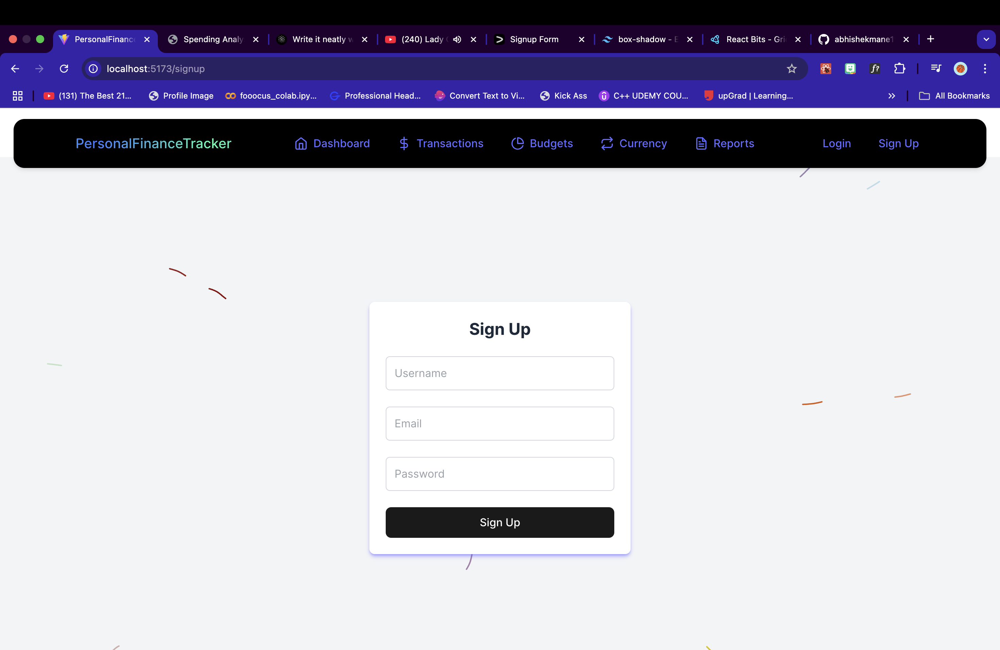
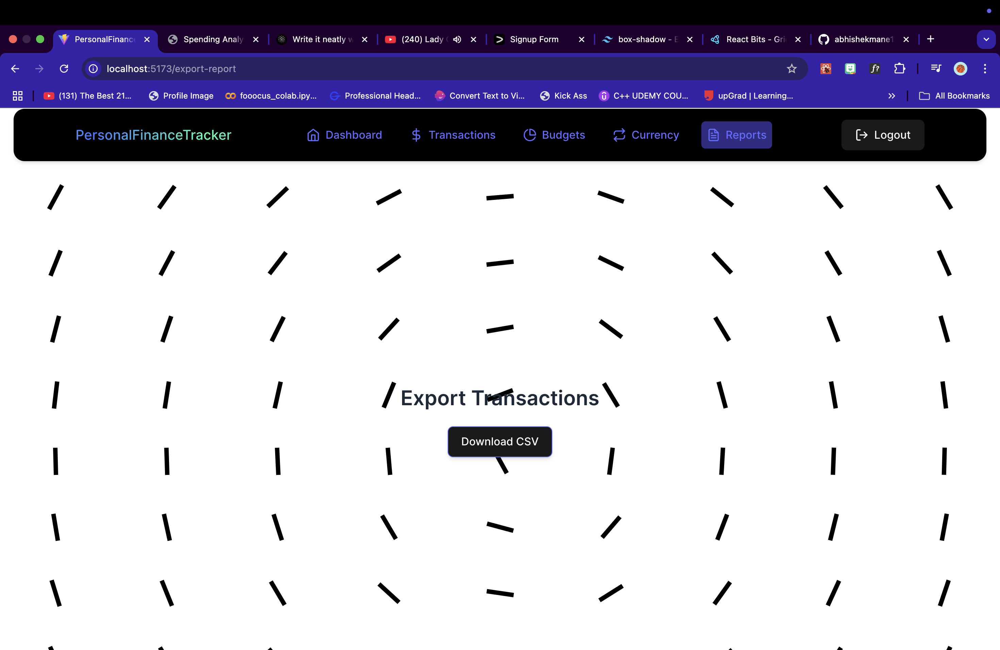
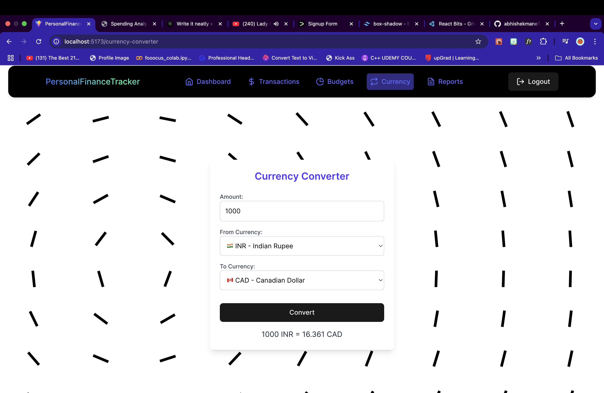

# PersonalFinanceTracker

# 💰 Finance Tracker Frontend

Finance Tracker is a web application that helps users manage their expenses, track budgets, and convert currencies. This is the **frontend** built using **React, TypeScript, Vite, and Tailwind CSS**, while the backend is powered by **Django and PostgreSQL**.

---

## 🚀 Features

- 📊 **Dashboard** – View an overview of your financial status.
- 💸 **Transactions** – Track income and expenses.
- 📅 **Budgets** – Set spending limits and monitor savings.
- 🔄 **Currency Converter** – Convert currencies in real-time.
- 📤 **Export Reports** – Download financial data as CSV files.
- 🔐 **JWT Authentication** – Secure login and user management.

---

## 🛠️ Tech Stack

### **Frontend**

- ⚡ **Vite + React** – Fast development with hot reloading.
- 🏗 **TypeScript** – Strongly typed and scalable.
- 🎨 **Tailwind CSS** – Modern styling with utility classes.
- 🔄 **React Query** – Efficient data fetching and caching.
- 🚦 **React Router** – Client-side navigation.
- 📡 **Axios** – API communication.

### **Backend**

- 🐍 **Django + DRF** – Handles authentication and business logic.
- 🗄️ **PostgreSQL** – Stores transactions and budget data.
- 🔑 **JWT Authentication** – Secure token-based auth.

---

### **Screenshots**






## 📦 Installation

### 1️⃣ Clone the Repository

```sh
git clone https://github.com/your-username/finance-tracker-frontend.git
cd finance-tracker-frontend
```

### 2️⃣ Installation Dependecies

```sh
npm install
```

### 3️⃣ Setup Tailwind

ensure tailwind is properly configured

```sh
npx tailwindcss init -p
```

check that your tailwind.config.js includes

```js
export default {
  content: ["./index.html", "./src/**/*.{js,jsx,ts,tsx}"],
  theme: { extend: {} },
  plugins: [],
};
```

### 4️⃣ Start your Development server

```sh
npm run dev
```

The app will be available at :

📍 http://localhost:5173

### ⚙️ Environment variables

Create a .env file in the route directory and add

```sh
VITE_API_BASE_URL=http://localhost:8000/api
VITE_JWT_SECRET=your-secret-key
```

Replace values accordingly

### 🛠️ Usage

1. Signup/ Login using valid credentials
2. Add transactions and track spendings
3. Set budget to control monthly expenses
4. Export a report for recorder keeping
5. Convert currency dynamically


### Authentication

- users are authenticated using JWT tokens
- Tokens are stored in local storage
- Protected route ensure security

### 📤 API Endpoints (Backend)


| Endpoint                  | Method | Description                    |
| ------------------------- | ------ | ------------------------------ |
| `/accounts/singup/`       | POST   | Register a new user            |
| `/accounts/login/`        | POST   | Log in and get JWT tokens      |
| `/accounts/logout/`       | POST   | Log out the user               |
| `/api/transactions/`      | GET    | Get all transactions           |
| `/api/transactions/`      | POST   | Add a new transaction          |
| `/api/transactions/{id}/` | GET    | Get a specific transaction     |
| `/api/transactions/{id}/` | DELETE | Delete a transaction           |
| `/api/budgets/`           | GET    | Get budget details             |
| `/api/budgets/`           | POST   | Create a new budget            |
| `/api/currency-convert/`  | POST   | Convert currency               |
| `/api/export-report/`     | GET    | Export financial report as CSV |
